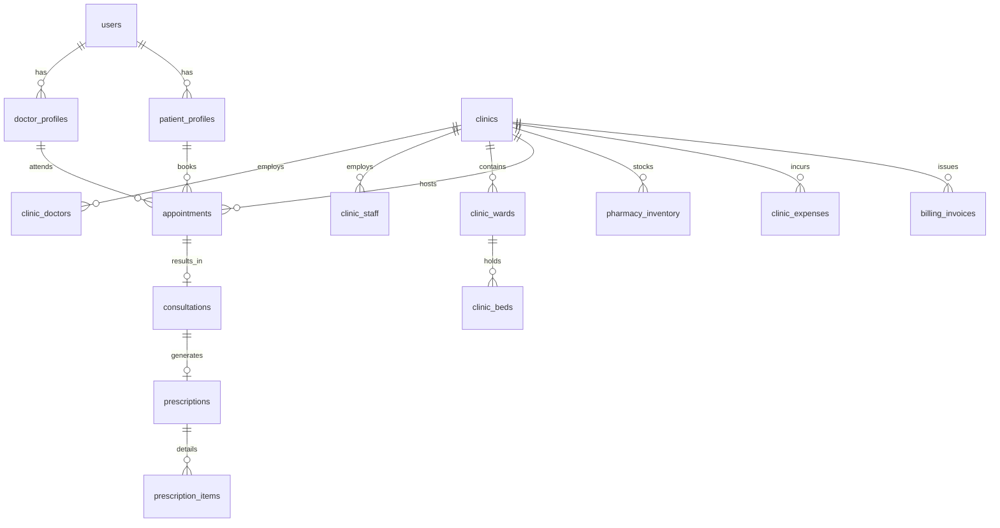

# CLINICOS / DOCSPHERE — HEALTHCARE DIGITAL INFRASTRUCTURE PLATFORM
## Complete Technical & Product Architecture Specification (CTO Master Blueprint)
**Version:** 1.0.0-PROD-SPEC  
**Target Market:** India (Tier-1, Tier-2, Tier-3) with Global Extensibility  
**Document Classification:** Production Architectural Specification  

---

## 1. PRODUCT VISION & CORE PHILOSOPHY

### 1.1 The Core Thesis: "Shopify for Independent Healthcare"
In India, healthcare software is broken into two extremes:
1. **Aggregators (e.g. Practo, Lybrate):** They pit doctors against each other, display competitor ads on doctors' profiles, hijack search traffic, and charge extortionate lead commissions.
2. **Bloated Enterprise ERPs:** Complex desktop software designed for 500-bed hospital chains that require 3 weeks of training and cost lakhs of rupees.

**The Solution:** Build the **digital operating layer for independent healthcare providers**.
A doctor or clinic signs up, gets a verified digital identity, an AI-configured clinic website, a live token/appointment engine, an in-patient bed management grid, an in-house pharmacy dispensary log, an expense ledger, and automated WhatsApp patient communication—in **under 60 seconds** with **zero technical knowledge**.

```
                           THE HEALTHCARE ECOSYSTEM FLYWHEEL
                                 ┌──────────────────┐
                                 │  INDEPENDENT     │
                                 │  DOCTORS/CLINICS │
                                 └────────┬─────────┘
                                          │ AI Onboarding (< 60s)
                                          ▼
                                 ┌──────────────────┐
                                 │ DIGITAL PRESENCE │
                                 │ & PRIVATE URL    │
                                 └────────┬─────────┘
                                          │ Maps & SEO Discovery
                                          ▼
                                 ┌──────────────────┐
                                 │ PATIENTS & TOKEN │
                                 │ APPOINTMENTS     │
                                 └────────┬─────────┘
                                          │ Consultation & Bed Care
                                          ▼
   ┌────────────────────────────────────────────────────────────────────────┐
   │                       CLINIC OPERATING ENGINE                          │
   │  [Digital Rx] ──► [In-House Pharmacy] ──► [Expense & Cashflow Ledger]  │
   └──────────────────────────────────────┬─────────────────────────────────┘
                                          │ Direct WhatsApp Engagement
                                          ▼
                                 ┌──────────────────┐
                                 │ PATIENT LOYALTY  │
                                 │ & RETENTION      │
                                 └──────────────────┘
```

### 1.2 Healthcare Safety First Principles
* **Non-Autonomous Clinical AI:** AI is an administrative and diagnostic drafting copilot, **never** an autonomous prescriber. Every prescription, dosage, and diagnostic note requires explicit doctor review and digital authorization.
* **Data Minimization & Patient Consent:** Patient records are isolated per clinic tenant. Receptionists see queue metadata but are restricted from reading clinical notes without consent.
* **ABDM / ABHA Ready:** Database and API abstractions adhere to Ayushman Bharat Digital Mission (ABDM) standards for M1, M2, and M3 milestone integration (ABHA ID generation, Health Information Provider/User workflows).

---

## 2. HIGH-LEVEL SYSTEM TOPOLOGY

```
                                  CLIENT ACCESS TIER
 ┌─────────────────────────────────────────────────────────────────────────────────────────┐
 │  Patients (Mobile Web / PWA)   │   Receptionist (PWA Desktop)   │   Doctors (Tablet / PC)│
 └────────────────────────────────────────┬────────────────────────────────────────────────┘
                                          │ HTTPS / WSS / TLS 1.3
                                          ▼
 ┌─────────────────────────────────────────────────────────────────────────────────────────┐
 │                       GLOBAL EDGE ROUTING & REVERSE PROXY                               │
 │   - Next.js Edge Middleware (Subdomain Multi-Tenant Routing: `slug.clinicos.in`)        │
 │   - Cloudflare DDoS Mitigation, WAF, SSL Termination, & Rate Limiting                   │
 └────────────────────────────────────────┬────────────────────────────────────────────────┘
                                          │
                  ┌───────────────────────┴───────────────────────┐
                  ▼                                               ▼
 ┌──────────────────────────────────┐            ┌──────────────────────────────────┐
 │      FRONTEND APPLICATION        │            │       BACKEND API GATEWAY        │
 │  - Next.js 15+ (App Router)      │            │  - FastAPI / Python 3.12+ Async  │
 │  - React 19, TypeScript, Tailwind│◄──────────►│  - Pydantic v2 Type Safety       │
 │  - shadcn/ui Component Primitive │  Internal  │  - OpenAPI / Swagger Docs        │
 │  - Service Worker (Offline PWA)  │  HTTP REST │  - Dependency Injection RBAC     │
 └──────────────────────────────────┘            └────────────────┬─────────────────┘
                                                                  │
       ┌───────────────────────────┬──────────────────────────────┼───────────────────────────┐
       ▼                           ▼                              ▼                           ▼
┌──────────────┐          ┌───────────────────┐         ┌───────────────────┐       ┌───────────────────┐
│ POSTGRESQL 16│          │   REDIS CLUSTER   │         │    AI GATEWAY     │       │ OBJECT STORAGE    │
│  + PGVECTOR  │          │ - Token Queues    │         │ - Gemini 1.5/2.0  │       │ - Cloudflare R2   │
│ - Multi-Tenant          │ - Rate Limiting   │         │ - OpenAI / Claude │       │   / AWS S3        │
│   Isolation             │ - Session Caching │         │ - Whisper (Audio) │       │ - Presigned URLs  │
│ - ACID Ledger           │ - Celery Broker   │         │ - Guardrails Proxy│       │ - Encrypted at Rest│
└──────────────┘          └───────────────────┘         └───────────────────┘       └───────────────────┘
       ▲                                                          ▲
       │                                                          │
┌──────┴──────────────────────────────────────────────────────────┴─────────────────────────────┐
│                        ASYNCHRONOUS WORKERS & INTEGRATION BUS                             │
│  - Celery Worker Pool (Report generation, PDF invoices, Scheduled WhatsApp follow-up alerts)│
│  - Notification Hub: Meta WhatsApp Cloud API, Twilio SMS, Resend Email                    │
│  - Payment Webhook Processors: Razorpay Gateway, UPI Intent, Stripe                       │
└───────────────────────────────────────────────────────────────────────────────────────────┘
```

---

## 3. USER ROLES & PERMISSION MATRIX (RBAC)

| Permission Area | SuperAdmin | Clinic Admin / Lead Doctor | Consulting Doctor | Receptionist / Staff | Patient |
| :--- | :---: | :---: | :---: | :---: | :---: |
| **Platform Analytics & Verification** | Full | None | None | None | None |
| **Clinic Profile & Branding** | Full | Full | Read Only | Read Only | Public View |
| **Doctor Schedule / OPD Slots** | Full | Full | Own Schedule | Read / View | Book Slot |
| **Bed Allocation & Ward Matrix** | Full | Full | Full (Assigned) | Check-in / Checkout | View My Bed |
| **Patient Queue / Token Calling**| Full | Full | Own Queue | Manage / Call | View My Token |
| **Clinical Notes & EMR Records** | None | Full | Authorized Only | **Strictly Forbidden** | View Own Rx |
| **Digital Prescription Studio** | None | Full | Own Patients | **Strictly Forbidden** | Download PDF |
| **In-House Pharmacy Inventory** | Read | Full | Prescribe Only | Dispense & Stock | View Bill |
| **Clinic Expense & Profit Ledger**| None | **Full (PIN Gate)**| None | Log Petty Expense | None |
| **Patient Follow-up WhatsApp** | View | Full | Trigger Own | Trigger Reception | Receive Msg |

---

## 4. RELATIONAL DATABASE SCHEMA (POSTGRESQL DDL SPECIFICATION)

The database schema is designed for multi-tenant isolation, high concurrency, strict foreign key constraints, and audit logging.



### 4.1 Core DDL Implementation

```sql
-- Enable necessary extensions
CREATE EXTENSION IF NOT EXISTS "uuid-ossp";
CREATE EXTENSION IF NOT EXISTS "pgcrypto";
CREATE EXTENSION IF NOT EXISTS "vector";

-- 1. USERS & IDENTITY
CREATE TABLE users (
    id UUID PRIMARY KEY DEFAULT gen_random_uuid(),
    phone VARCHAR(20) UNIQUE NOT NULL,
    email VARCHAR(255) UNIQUE,
    password_hash TEXT NOT NULL,
    full_name VARCHAR(150) NOT NULL,
    role VARCHAR(50) NOT NULL CHECK (role IN ('patient', 'doctor', 'clinic_admin', 'staff', 'pharmacy', 'diagnostic', 'admin', 'superadmin')),
    is_active BOOLEAN DEFAULT TRUE,
    is_verified BOOLEAN DEFAULT FALSE,
    avatar_url TEXT,
    created_at TIMESTAMPTZ DEFAULT NOW(),
    updated_at TIMESTAMPTZ DEFAULT NOW(),
    deleted_at TIMESTAMPTZ
);
CREATE INDEX idx_users_phone ON users(phone);
CREATE INDEX idx_users_role ON users(role);

-- 2. CLINICS (TENANT ENTITY)
CREATE TABLE clinics (
    id UUID PRIMARY KEY DEFAULT gen_random_uuid(),
    slug VARCHAR(100) UNIQUE NOT NULL,
    name VARCHAR(200) NOT NULL,
    owner_user_id UUID NOT NULL REFERENCES users(id),
    tagline VARCHAR(255),
    about TEXT,
    phone VARCHAR(20) NOT NULL,
    whatsapp_number VARCHAR(20),
    email VARCHAR(255),
    address_line TEXT NOT NULL,
    city VARCHAR(100) NOT NULL,
    state VARCHAR(100) NOT NULL,
    postal_code VARCHAR(20) NOT NULL,
    latitude DOUBLE PRECISION,
    longitude DOUBLE PRECISION,
    google_maps_url TEXT,
    logo_url TEXT,
    cover_photo_url TEXT,
    photos TEXT[], -- Array of image URLs
    facilities TEXT[], -- e.g. ['ICU', 'Oxygen', 'Pharmacy', 'WiFi', 'Wheelchair', 'AC']
    opening_hours JSONB NOT NULL DEFAULT '{}',
    is_verified BOOLEAN DEFAULT FALSE,
    status VARCHAR(30) DEFAULT 'pending' CHECK (status IN ('pending', 'active', 'suspended', 'rejected')),
    created_at TIMESTAMPTZ DEFAULT NOW(),
    updated_at TIMESTAMPTZ DEFAULT NOW()
);
CREATE INDEX idx_clinics_slug ON clinics(slug);
CREATE INDEX idx_clinics_city ON clinics(city);
CREATE INDEX idx_clinics_geo ON clinics(latitude, longitude);

-- 3. DOCTOR PROFILES
CREATE TABLE doctor_profiles (
    id UUID PRIMARY KEY DEFAULT gen_random_uuid(),
    user_id UUID UNIQUE NOT NULL REFERENCES users(id) ON DELETE CASCADE,
    slug VARCHAR(100) UNIQUE NOT NULL,
    title VARCHAR(20) DEFAULT 'Dr.',
    medical_council_reg_number VARCHAR(100) NOT NULL,
    medical_council_state VARCHAR(100) NOT NULL,
    qualification_summary VARCHAR(255) NOT NULL, -- e.g. 'MBBS, MD (Dermatology)'
    specialization VARCHAR(100) NOT NULL,
    sub_specializations TEXT[],
    years_of_experience INT DEFAULT 0,
    languages_spoken TEXT[] DEFAULT ARRAY['English', 'Hindi'],
    bio TEXT,
    consultation_fee NUMERIC(10, 2) NOT NULL DEFAULT 500.00,
    followup_fee NUMERIC(10, 2) NOT NULL DEFAULT 0.00,
    followup_validity_days INT DEFAULT 7,
    services_offered JSONB DEFAULT '[]',
    verification_status VARCHAR(30) DEFAULT 'pending' CHECK (verification_status IN ('pending', 'under_review', 'verified', 'rejected')),
    verification_documents JSONB DEFAULT '[]',
    rating NUMERIC(3, 2) DEFAULT 5.00,
    total_reviews INT DEFAULT 0,
    created_at TIMESTAMPTZ DEFAULT NOW(),
    updated_at TIMESTAMPTZ DEFAULT NOW()
);
CREATE INDEX idx_doctor_specialization ON doctor_profiles(specialization);
CREATE INDEX idx_doctor_slug ON doctor_profiles(slug);

-- 4. CLINIC-DOCTOR RELATIONSHIP (Multi-Doctor PolyClinics)
CREATE TABLE clinic_doctors (
    id UUID PRIMARY KEY DEFAULT gen_random_uuid(),
    clinic_id UUID NOT NULL REFERENCES clinics(id) ON DELETE CASCADE,
    doctor_id UUID NOT NULL REFERENCES doctor_profiles(id) ON DELETE CASCADE,
    is_primary_owner BOOLEAN DEFAULT FALSE,
    consultation_fee_override NUMERIC(10, 2),
    opd_schedules JSONB NOT NULL DEFAULT '[]', -- Slot definitions, shifts, intervals
    created_at TIMESTAMPTZ DEFAULT NOW(),
    UNIQUE(clinic_id, doctor_id)
);

-- 5. IN-PATIENT BEDS & WARDS MATRIX
CREATE TABLE clinic_wards (
    id UUID PRIMARY KEY DEFAULT gen_random_uuid(),
    clinic_id UUID NOT NULL REFERENCES clinics(id) ON DELETE CASCADE,
    name VARCHAR(100) NOT NULL, -- e.g. 'General Ward', 'ICU', 'Deluxe AC Room'
    ward_type VARCHAR(50) NOT NULL CHECK (ward_type IN ('general', 'semi_private', 'private_deluxe', 'icu', 'daycare_recovery')),
    daily_rate NUMERIC(10, 2) NOT NULL,
    hourly_rate NUMERIC(10, 2) DEFAULT 0.00,
    created_at TIMESTAMPTZ DEFAULT NOW()
);

CREATE TABLE clinic_beds (
    id UUID PRIMARY KEY DEFAULT gen_random_uuid(),
    clinic_id UUID NOT NULL REFERENCES clinics(id) ON DELETE CASCADE,
    ward_id UUID NOT NULL REFERENCES clinic_wards(id) ON DELETE CASCADE,
    bed_number VARCHAR(50) NOT NULL, -- e.g. 'Bed-01', 'ICU-3'
    status VARCHAR(30) DEFAULT 'vacant' CHECK (status IN ('vacant', 'occupied', 'discharge_pending', 'maintenance')),
    current_patient_id UUID REFERENCES users(id),
    admission_timestamp TIMESTAMPTZ,
    created_at TIMESTAMPTZ DEFAULT NOW(),
    UNIQUE(clinic_id, bed_number)
);

-- 6. PATIENT PROFILES
CREATE TABLE patient_profiles (
    id UUID PRIMARY KEY DEFAULT gen_random_uuid(),
    user_id UUID UNIQUE NOT NULL REFERENCES users(id) ON DELETE CASCADE,
    gender VARCHAR(20) CHECK (gender IN ('male', 'female', 'other')),
    dob DATE,
    blood_group VARCHAR(10),
    allergies TEXT[],
    chronic_conditions TEXT[],
    emergency_contact_name VARCHAR(100),
    emergency_contact_phone VARCHAR(20),
    city VARCHAR(100),
    created_at TIMESTAMPTZ DEFAULT NOW(),
    updated_at TIMESTAMPTZ DEFAULT NOW()
);

-- 7. APPOINTMENTS & LIVE TOKENS
CREATE TABLE appointments (
    id UUID PRIMARY KEY DEFAULT gen_random_uuid(),
    appointment_number VARCHAR(50) UNIQUE NOT NULL,
    clinic_id UUID NOT NULL REFERENCES clinics(id),
    doctor_id UUID NOT NULL REFERENCES doctor_profiles(id),
    patient_id UUID NOT NULL REFERENCES users(id),
    appointment_date DATE NOT NULL,
    time_slot VARCHAR(50), -- e.g. '10:30 AM - 10:45 AM' or 'Token #14'
    token_number INT NOT NULL,
    consultation_type VARCHAR(20) DEFAULT 'in_person' CHECK (consultation_type IN ('in_person', 'video', 'emergency')),
    status VARCHAR(30) DEFAULT 'confirmed' CHECK (status IN ('requested', 'confirmed', 'in_waiting', 'in_consultation', 'completed', 'cancelled', 'no_show')),
    fee_amount NUMERIC(10, 2) NOT NULL,
    payment_status VARCHAR(30) DEFAULT 'pending' CHECK (payment_status IN ('pending', 'paid', 'refunded', 'waived')),
    payment_mode VARCHAR(30) CHECK (payment_mode IN ('cash', 'upi', 'card', 'online')),
    symptoms_description TEXT,
    cancelled_reason TEXT,
    created_at TIMESTAMPTZ DEFAULT NOW(),
    updated_at TIMESTAMPTZ DEFAULT NOW()
);
CREATE INDEX idx_appointments_date_clinic ON appointments(clinic_id, appointment_date);

-- 8. CONSULTATIONS & CLINICAL EMR
CREATE TABLE consultations (
    id UUID PRIMARY KEY DEFAULT gen_random_uuid(),
    appointment_id UUID UNIQUE NOT NULL REFERENCES appointments(id),
    patient_id UUID NOT NULL REFERENCES users(id),
    doctor_id UUID NOT NULL REFERENCES doctor_profiles(id),
    clinic_id UUID NOT NULL REFERENCES clinics(id),
    vitals JSONB DEFAULT '{}', -- { bp: '120/80', pulse: 72, temp: 98.6, weight: 68 }
    symptoms TEXT[],
    clinical_findings TEXT,
    provisional_diagnosis TEXT NOT NULL,
    investigation_advised TEXT[], -- e.g. ['CBC', 'Skin Scraping for Fungus']
    followup_date DATE,
    is_signed BOOLEAN DEFAULT FALSE,
    signed_at TIMESTAMPTZ,
    created_at TIMESTAMPTZ DEFAULT NOW(),
    updated_at TIMESTAMPTZ DEFAULT NOW()
);

-- 9. DIGITAL PRESCRIPTIONS
CREATE TABLE prescriptions (
    id UUID PRIMARY KEY DEFAULT gen_random_uuid(),
    prescription_number VARCHAR(50) UNIQUE NOT NULL,
    consultation_id UUID UNIQUE NOT NULL REFERENCES consultations(id),
    patient_id UUID NOT NULL REFERENCES users(id),
    doctor_id UUID NOT NULL REFERENCES doctor_profiles(id),
    clinic_id UUID NOT NULL REFERENCES clinics(id),
    instructions TEXT,
    pdf_url TEXT,
    qr_verification_code VARCHAR(100) UNIQUE NOT NULL,
    created_at TIMESTAMPTZ DEFAULT NOW()
);

CREATE TABLE prescription_items (
    id UUID PRIMARY KEY DEFAULT gen_random_uuid(),
    prescription_id UUID NOT NULL REFERENCES prescriptions(id) ON DELETE CASCADE,
    medicine_name VARCHAR(200) NOT NULL,
    dosage_form VARCHAR(50) NOT NULL, -- e.g. 'Tablet', 'Syrup', 'Ointment', 'Injection'
    strength VARCHAR(50), -- e.g. '650 mg', '500 mg'
    dosage_frequency VARCHAR(50) NOT NULL, -- e.g. '1-0-1', 'Once Daily'
    timing_relation VARCHAR(50) NOT NULL, -- e.g. 'After Food', 'Before Breakfast'
    duration_days INT NOT NULL,
    special_instructions TEXT
);

-- 10. IN-HOUSE PHARMACY & INVENTORY
CREATE TABLE pharmacy_inventory (
    id UUID PRIMARY KEY DEFAULT gen_random_uuid(),
    clinic_id UUID NOT NULL REFERENCES clinics(id) ON DELETE CASCADE,
    brand_name VARCHAR(200) NOT NULL,
    generic_composition TEXT NOT NULL,
    dosage_form VARCHAR(50) NOT NULL,
    batch_number VARCHAR(100) NOT NULL,
    expiry_date DATE NOT NULL,
    purchase_price_per_unit NUMERIC(10, 2) NOT NULL,
    selling_mrp_per_unit NUMERIC(10, 2) NOT NULL,
    stock_quantity INT NOT NULL DEFAULT 0,
    reorder_threshold INT DEFAULT 20,
    created_at TIMESTAMPTZ DEFAULT NOW(),
    updated_at TIMESTAMPTZ DEFAULT NOW(),
    UNIQUE(clinic_id, batch_number)
);

CREATE TABLE pharmacy_dispense_logs (
    id UUID PRIMARY KEY DEFAULT gen_random_uuid(),
    clinic_id UUID NOT NULL REFERENCES clinics(id),
    patient_id UUID REFERENCES users(id),
    prescription_id UUID REFERENCES prescriptions(id),
    dispensed_by UUID REFERENCES users(id),
    total_mrp NUMERIC(10, 2) NOT NULL,
    total_cost NUMERIC(10, 2) NOT NULL,
    net_profit NUMERIC(10, 2) NOT NULL,
    items JSONB NOT NULL, -- [{ item_id, brand_name, qty, unit_price, total }]
    payment_mode VARCHAR(30) DEFAULT 'cash',
    created_at TIMESTAMPTZ DEFAULT NOW()
);

-- 11. CLINIC CASHFLOW & EXPENSE LEDGER
CREATE TABLE clinic_expenses (
    id UUID PRIMARY KEY DEFAULT gen_random_uuid(),
    clinic_id UUID NOT NULL REFERENCES clinics(id) ON DELETE CASCADE,
    category VARCHAR(100) NOT NULL, -- e.g. 'Electricity', 'Staff Salaries', 'Pharmacy Stock', 'Oxygen Supply', 'Rent'
    amount NUMERIC(12, 2) NOT NULL,
    expense_date DATE NOT NULL DEFAULT CURRENT_DATE,
    description TEXT,
    payment_mode VARCHAR(30) DEFAULT 'upi',
    receipt_image_url TEXT,
    created_by UUID REFERENCES users(id),
    created_at TIMESTAMPTZ DEFAULT NOW()
);

-- 12. AI CONVERSATIONS & COST AUDITING
CREATE TABLE ai_usage_logs (
    id UUID PRIMARY KEY DEFAULT gen_random_uuid(),
    clinic_id UUID REFERENCES clinics(id),
    user_id UUID REFERENCES users(id),
    agent_type VARCHAR(50) NOT NULL, -- e.g. 'onboarding_agent', 'profile_synthesizer', 'consultation_scribe', 'receptionist'
    model_name VARCHAR(100) NOT NULL, -- e.g. 'gemini-1.5-flash', 'gpt-4o'
    input_tokens INT NOT NULL,
    output_tokens INT NOT NULL,
    estimated_cost_usd NUMERIC(8, 6) NOT NULL,
    created_at TIMESTAMPTZ DEFAULT NOW()
);
```

---

## 5. COMPLETE API ARCHITECTURE (REST SPECIFICATION)

All endpoints follow strict REST conventions, consume and produce JSON, and handle authentication via Bearer Tokens (JWT).

### 5.1 Route Hierarchy
* **`/api/v1/auth`**: Authentication, OTP verify, refresh tokens, role switching.
* **`/api/v1/onboarding`**: Conversational AI stream, document OCR extractor, profile auto-synthesizer.
* **`/api/v1/doctors`**: Public doctor profiles, schedule slots, reviews.
* **`/api/v1/clinics`**: Public clinic directory, hospital facilities, doctor rosters.
* **`/api/v1/search`**: Geo-spatial discovery ("Doctors near me"), specialization filter, price sorting.
* **`/api/v1/appointments`**: Token generation, slot booking, queue status updates, cancellation.
* **`/api/v1/beds`**: Live bed matrix, ward definitions, patient admission & discharge calculation.
* **`/api/v1/consultations`**: Clinical vitals, diagnosis recording, Rx attachment.
* **`/api/v1/prescriptions`**: Structured medication builder, PDF generator, WhatsApp dispatch.
* **`/api/v1/pharmacy`**: Inventory log, low-stock alerts, 1-click Rx dispense.
* **`/api/v1/expenses`**: Clinic cashflow, outgoing expenses, daily/monthly P&L report.
* **`/api/v1/admin`**: Provider credential verification, license checks, platform analytics.

### 5.2 API Request/Response Contracts

#### A. AI Conversational Onboarding Endpoint
* **`POST /api/v1/onboarding/extract`**
```json
// Request
{
  "raw_transcript": "I am Dr. Alok Mathur, Senior Orthopedic Surgeon with 16 years experience. My clinic is Bone & Joint Care in EC Road, Dehradun. Consultation fee is 700 rupees. I treat arthritis, fractures, and sports injuries.",
  "uploaded_image_urls": ["https://cdn.clinicos.in/temp/letterhead_102.jpg"]
}

// Response (200 OK)
{
  "status": "success",
  "extracted_data": {
    "doctor": {
      "name": "Dr. Alok Mathur",
      "specialization": "Orthopedics",
      "years_of_experience": 16,
      "consultation_fee": 700.00,
      "services": ["Arthritis Management", "Fracture Treatment", "Sports Injury Rehabilitation"]
    },
    "clinic": {
      "name": "Bone & Joint Care Clinic",
      "address_line": "EC Road",
      "city": "Dehradun",
      "state": "Uttarakhand"
    },
    "missing_critical_fields": [
      "medical_council_reg_number",
      "phone_number",
      "opd_timings"
    ]
  },
  "suggested_prompt": "Thanks Dr. Mathur! Could you please share your State Medical Council registration number and your morning/evening OPD timings?"
}
```

#### B. Live Waiting Queue & Token Status Endpoint
* **`GET /api/v1/appointments/live-queue?clinic_id=...&doctor_id=...&date=2026-09-16`**
```json
// Response (200 OK)
{
  "current_active_token": 14,
  "total_tokens_booked": 38,
  "estimated_wait_minutes_per_patient": 8,
  "queue_list": [
    { "token": 14, "patient_name": "R. Sharma", "status": "in_consultation" },
    { "token": 15, "patient_name": "A. Verma", "status": "in_waiting" },
    { "token": 16, "patient_name": "S. Negi", "status": "in_waiting" }
  ]
}
```

---

## 6. FRONTEND ARCHITECTURE & DESIGN SYSTEM (PWA)

```
apps/web/
├── app/
│   ├── (public)/                 # SEO Indexed Marketing & Discovery
│   │   ├── page.tsx              # Modern Hero Landing ("Your Clinic. Online. Connected.")
│   │   ├── doctors/[slug]/       # Digital Doctor Profile (Schema.org MedProfile)
│   │   ├── clinics/[slug]/       # Digital Clinic Page (Live OPD & Bed Availability)
│   │   ├── search/               # Map + List Geo-Discovery View
│   │   ├── onboarding/           # Conversational AI Onboarding Wizard
│   │   └── login/                # Unified Role-Aware Login
│   │
│   ├── (patient)/app/patient/    # Patient Portal
│   │   ├── appointments/         # Active & Past Tokens, Live Wait Status
│   │   ├── prescriptions/        # Interactive Digital Prescriptions & PDF Vault
│   │   └── records/              # Uploaded Lab Reports & Diagnostic History
│   │
│   ├── (doctor)/app/doctor/      # Doctor Workspace Console
│   │   ├── queue/                # 1-Tap Token Calling & Patient Intake
│   │   ├── consult/[id]/         # Consultation Studio & Voice-to-Rx Scribe
│   │   ├── schedule/             # OPD Shifts, Intervals & Break Management
│   │   └── analytics/            # Patient Growth & Monthly OPD Revenue
│   │
│   ├── (clinic)/app/clinic/      # Clinic Administration Console
│   │   ├── beds/                 # Visual Bed & Ward Matrix (Color States)
│   │   ├── pharmacy/             # In-House Dispensary & Low-Stock Alerts
│   │   ├── expenses/             # Daily P&L, Clinic Outflows & Inflows
│   │   └── staff/                # Receptionist Accounts & Permissions
│   │
│   └── (admin)/app/admin/        # Platform Governance
│       ├── verifications/        # License Review & Registry Verification
│       └── metrics/              # System-wide MRR, Active Providers & AI Costs
```

### 6.1 Progressive Web App (PWA) Capabilities
* **`manifest.webmanifest` Configuration:** Supports `"display": "standalone"`. When added to the home screen or installed on Windows/macOS, it runs in a dedicated application frame with native-feeling keyboard shortcuts.
* **Offline Service Workers:** Caches active patient queue tokens, drug templates, and bed matrices. If broadband temporarily drops in a clinic, the front desk can continue calling tokens and dispensing medicines; sync resumes automatically upon reconnect.
* **0% App Store Cut:** Direct billing through UPI & Razorpay without 30% deductions by Apple or Google.

---

## 7. AI ARCHITECTURE & AGENT GATEWAY

The AI engine is structured as a **Gateway Pattern with Human-in-the-Loop Safeguards**.

```
                           AI REQUEST GATEWAY
                                   │
         ┌─────────────────────────┼─────────────────────────┐
         ▼                         ▼                         ▼
┌───────────────────┐    ┌───────────────────┐    ┌───────────────────┐
│ ONBOARDING AGENT  │    │  SCRIBE CO-PILOT  │    │ AI RECEPTIONIST   │
│ - Multimodal OCR  │    │ - Audio-to-Rx     │    │ - WhatsApp / Web  │
│ - Letterhead Scan │    │ - Formatter       │    │ - Slot Booking    │
│ - Entity Parse    │    │ - Interaction Chk │    │ - FAQs & Address  │
└────────┬──────────┘    └─────────┬─────────┘    └─────────┬─────────┘
         │                         │                        │
         └─────────────────────────┼────────────────────────┘
                                   │
                                   ▼
                   ┌───────────────────────────────┐
                   │   SAFETY & GUARDRAIL FILTER   │
                   │ - Disallow auto-prescribe     │
                   │ - Mask private patient PII    │
                   │ - Token & Cost Limit Auditor  │
                   └───────────────┬───────────────┘
                                   │
                                   ▼
                   ┌───────────────────────────────┐
                   │    DOCTOR APPROVAL REQUIRED   │
                   │  [ Edit ]  [ Sign & Publish ] │
                   └───────────────────────────────┘
```

### 7.1 Key AI Sub-Agents & Prompts

#### 1. The Doctor Consultation Scribe Agent
* **System Prompt:**
  > *"You are an expert clinical scribe assistant. Your task is to listen to the doctor-patient dialogue or voice note and extract: (1) Presenting Complaints, (2) Clinical Observations, (3) Diagnosis, and (4) Medications with dosage, frequency, and duration.  
  > CRITICAL: You must output ONLY a valid JSON object matching the PrescriptionSchema. NEVER add medicines not explicitly named by the doctor. Always mark output as DRAFT requiring doctor confirmation."*

#### 2. The 24/7 AI Clinic Receptionist (Web & WhatsApp)
* **Tools Available:**
  * `get_doctor_slots(doctor_id, date)`
  * `book_token(patient_name, phone, slot)`
  * `get_clinic_address_and_timings()`
* **Boundary:** If a patient asks: *"I have severe chest pain, which medicine should I take?"*, the AI immediately triggers an emergency protocol:
  > *"⚠️ This sounds like an emergency. Please visit our casualty/emergency department immediately at [Clinic Address] or dial 108/112. Our AI does not provide emergency medical advice."*

---

## 8. SECURITY, PRIVACY & ABDM COMPLIANCE

1. **Multi-Tenant Row-Level Security (RLS):**
   * Every SQL query against patients, appointments, and beds must explicitly enforce `WHERE clinic_id = :current_tenant_id`.
   * Cross-tenant data access is rejected at both the database and middleware layers.
2. **Medical Documents (Signed URLs & Encryption):**
   * Medical scans and lab reports are stored in private Cloudflare R2 / AWS S3 buckets with server-side AES-256 encryption.
   * Access is provided solely via time-limited **Presigned URLs (max 15-minute expiration)** generated only after verifying the doctor's active appointment relationship with that patient.
3. **Audit Logging:**
   * Every view, export, or edit of patient health records (EMR) is recorded in `audit_logs` with `user_id`, `timestamp`, `ip_address`, and `action_type`.

---

## 9. MONOREPO FOLDER STRUCTURE

```
clinicos/
├── .github/workflows/          # CI/CD (Test, Lint, Security Scan, Deploy)
├── apps/
│   ├── web/                    # Next.js 15+ Frontend (PWA + SSR Profile Pages)
│   │   ├── app/                # App Router routes
│   │   ├── components/         # Design System (Tailwind + Radix/shadcn)
│   │   ├── hooks/              # Custom React hooks (useQueue, useBedMatrix)
│   │   ├── lib/                # API Client, PWA Service Worker reg
│   │   └── public/             # Icons, Manifest, Static assets
│   │
│   └── api/                    # FastAPI Backend Server
│       ├── app/
│       │   ├── api/v1/         # Route controllers (Auth, Doctors, Beds, Rx)
│       │   ├── core/           # Config, Security, JWT, Database session
│       │   ├── models/         # SQLAlchemy ORM Data Models
│       │   ├── schemas/        # Pydantic validation schemas
│       │   ├── services/       # Business logic (Billing, Queue, WhatsApp)
│       │   └── ai/             # AI Gateway, Prompts, LLM Provider router
│       ├── main.py             # Server entrypoint
│       └── Dockerfile          # Production container spec
│
├── packages/
│   ├── database/               # Alembic Migrations & Seed Data
│   └── types/                  # Shared TypeScript interfaces
│
├── infrastructure/
│   ├── docker-compose.yml      # Local dev environment (API, Web, Postgres, Redis)
│   └── caddy/                  # Reverse proxy with automatic SSL
│
└── docs/                       # API specs, ABDM integration guides
```

---

## 10. SYSTEMATIC MVP IMPLEMENTATION ROADMAP

```
┌─────────────────────────────────────────────────────────────────────────────┐
│                       7-PHASE EXECUTION ROADMAP                             │
├─────────────────────────────────────────────────────────────────────────────┤
│ PHASE 1: Core Foundation & Multi-Tenant Data Layer                          │
│   - Setup Monorepo, PostgreSQL DDL schemas, Alembic migrations              │
│   - JWT / Phone OTP authentication with granular RBAC                       │
│   - SuperAdmin portal for manual doctor credential verification             │
├─────────────────────────────────────────────────────────────────────────────┤
│ PHASE 2: Doctor Onboarding Engine & Digital Profiles                        │
│   - Conversational AI onboarding wizard + Letterhead OCR parsing            │
│   - Auto-generated SEO-optimized Doctor (`/doctors/[slug]`) and             │
│     Clinic (`/clinics/[slug]`) public landing pages                         │
├─────────────────────────────────────────────────────────────────────────────┤
│ PHASE 3: Live Appointment & Token Engine                                    │
│   - Configurable OPD shifts, minute-interval clash engine                   │
│   - Patient slot booking & live queue status tracker                        │
│   - Receptionist Desk for 1-click token calling                             │
├─────────────────────────────────────────────────────────────────────────────┤
│ PHASE 4: $N$-Bed Inpatient Matrix & Clinical EMR                            │
│   - Visual Ward & Bed Matrix (Green, Red, Yellow states)                    │
│   - Bed admission, auto-hourly/daily stay charge calculator                 │
│   - Consultation Studio & Digital Prescription Builder (PDF export)         │
├─────────────────────────────────────────────────────────────────────────────┤
│ PHASE 5: In-House Pharmacy, Inventory & Financial Ledger                    │
│   - Stock management with batch, expiry dates & wholesale/MRP margins       │
│   - 1-Click Rx dispense & unified patient billing                           │
│   - Clinic Expense Ledger & Daily Net Profit/Loss calculations              │
├─────────────────────────────────────────────────────────────────────────────┤
│ PHASE 6: WhatsApp Automation & PWA Packaging                                │
│   - WhatsApp Cloud API: Automated Token status, Rx PDF, Follow-up alerts    │
│   - Progressive Web App (PWA) manifest & offline service workers           │
├─────────────────────────────────────────────────────────────────────────────┤
│ PHASE 7: Search, Discovery & Field Pilot Deployment                         │
│   - Geo-location "Doctors near me" search filter                            │
│   - Pilot deployment with Dehradun clinic testbed (EC Road / Chakrata Rd)   │
└─────────────────────────────────────────────────────────────────────────────┘
```

---

### **CTO Architectural Sign-Off**
This specification transforms the tested principles of your library management architecture into a **production-ready, highly defensible healthcare digital platform**. 

*Every architectural building block—from the slot clash mathematics to multi-tenant isolation, expense tracking, and WhatsApp communication—directly leverages your proven system foundation while adhering to the highest standards of medical software integrity.*
